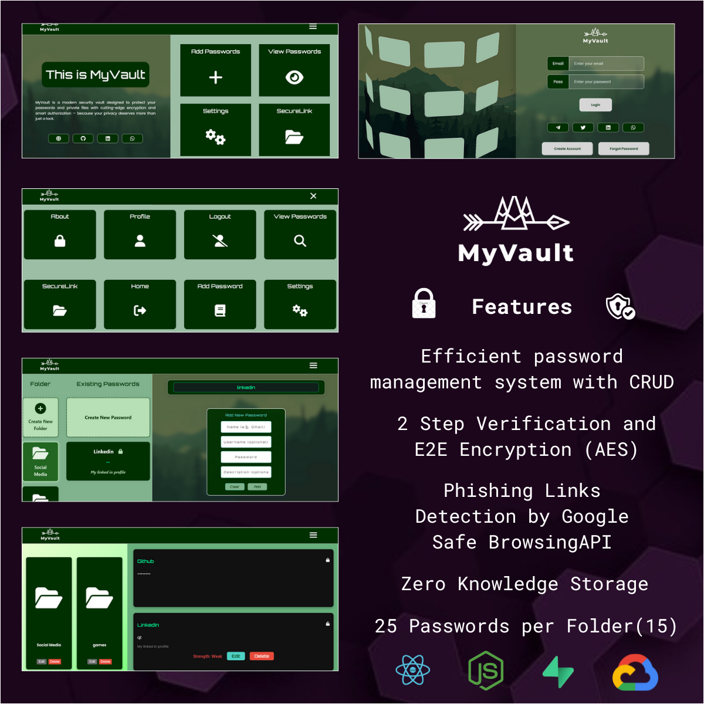
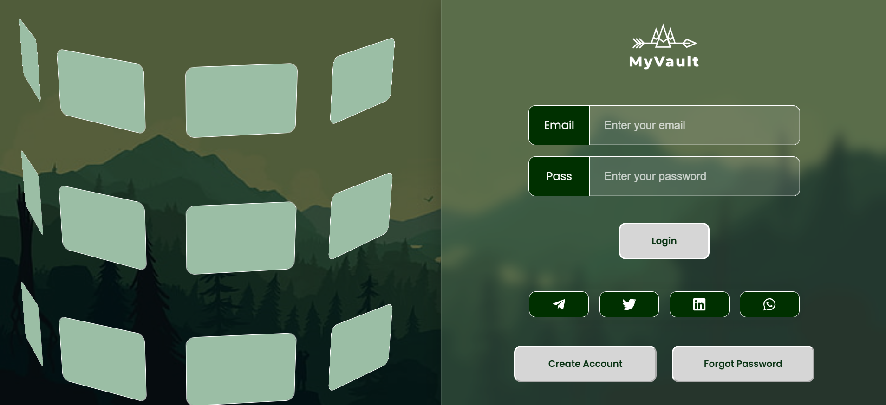
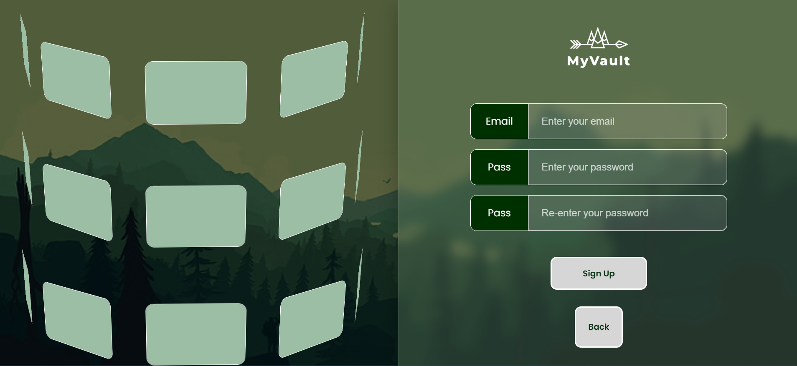
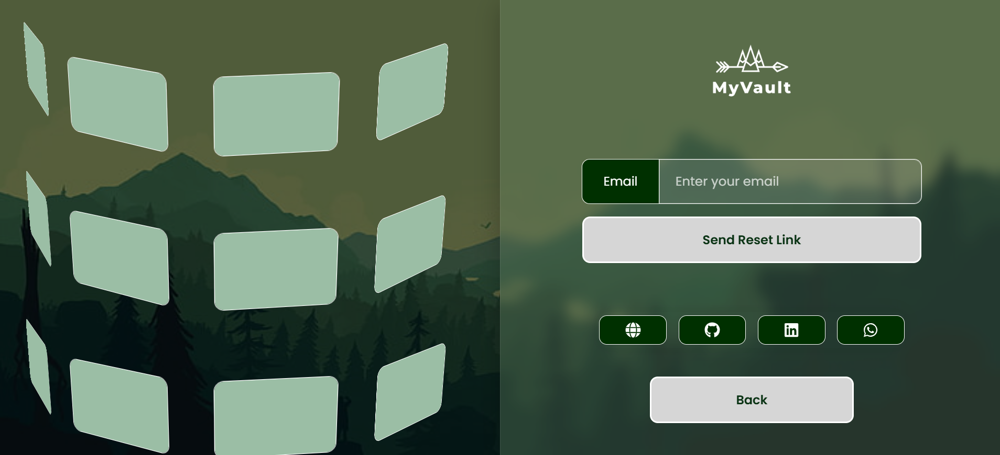
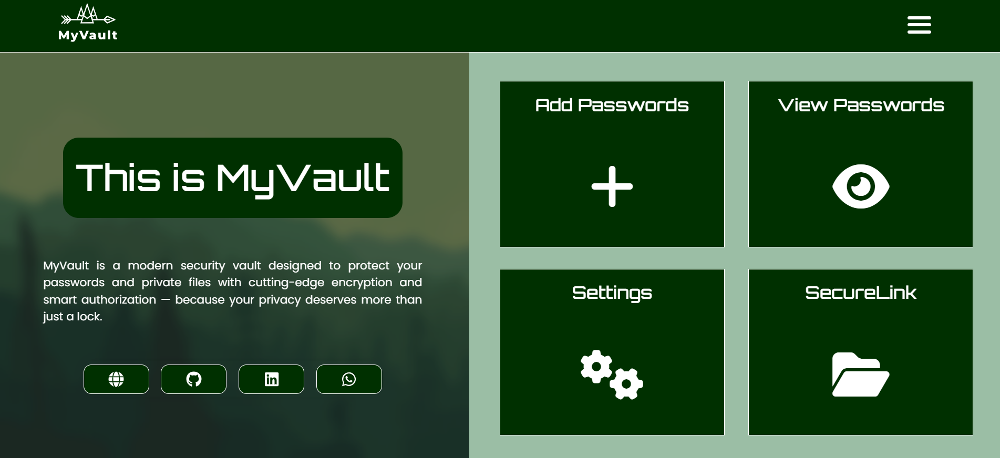
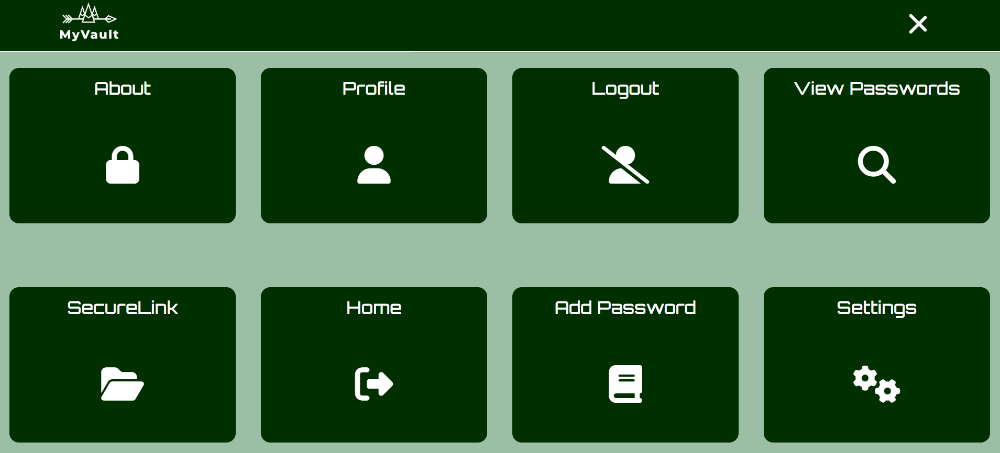
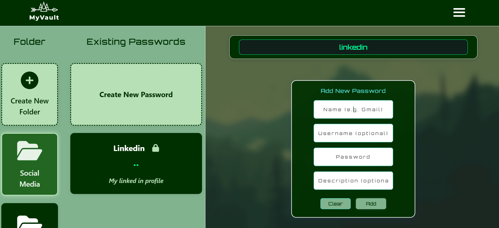
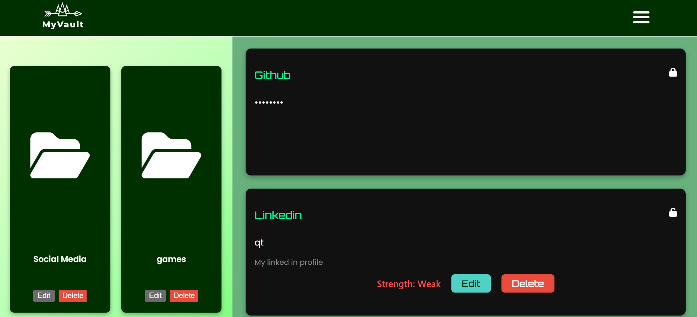
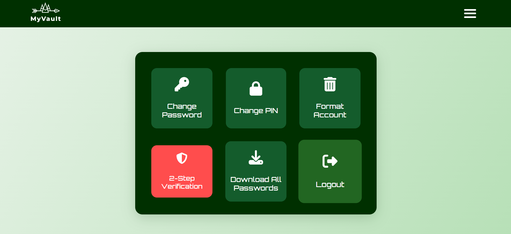

<!-- TITLE with Animated Typing Effect -->

  

  

 

<h1 align="center">🔒 MyVault Password Repo 🔒</h1>
<h3 align="center">Layered Security, Smart Design — Password Management, Reinvented.</h3>

 

  

 
 

  

 

---
## 🚀 What Did I Build?

**MyVault Password Manager** is a secure, modern password management app built with **React**, **CSS**, **Vite**, and powered by **Supabase** for authentication and encrypted data storage.

- PIN and two-step verification (2FA) for strong user authentication  
- Client-side AES encryption for all sensitive data  
- Phishing detection with backend proxy for safe browsing  
- User-specific PINs stored securely with Row Level Security (RLS)  
- Lockout protection after failed PIN attempts  
- Clean, responsive interface for all devices  

 

---

 

## 🔒 What is This Project?

**MyVault** is a full-stack password manager designed for robust security and ease of use. It leverages **Supabase** for secure authentication, encrypted storage, and real-time data sync, ensuring your passwords are always protected and accessible.

This project is ideal for anyone who wants a reliable, privacy-focused password manager with advanced security features, including phishing detection and layered access control.

It combines a modern, intuitive UI with a strong security foundation, making it suitable for both personal and professional use.

 

---

 

## 📸 Screenshots

  
  
  
 
  
  

 
  
  

   
  
  

 
  
  

   
  
  

   
  
  

   
  
  

   

   

   
  
  

   
  

---

## 🛠️ Tech Stack and Tools

 

<table>
  <thead>
    <tr>
      <th>Tech Used</th>
      <th>Purpose</th>
    </tr>
  </thead>
  <tbody>
    <tr>
      <td>React</td>
      <td>Frontend UI library for fast, component-based views</td>
    </tr>
    <tr>
      <td>CSS</td>
      <td>Styling framework for responsive, modern layouts</td>
    </tr>
    <tr>
      <td>Supabase</td>
      <td>Backend for authentication, database, and secure storage</td>
    </tr>
    <tr>
      <td>Vite</td>
      <td>Fast build tool and development server</td>
    </tr>
    <tr>
      <td>Node.js & Express</td>
      <td>Backend server for SecureLink phishing detection and API proxy</td>
    </tr>
    <tr>
      <td>Vercel</td>
      <td>Hosting and deployment</td>
    </tr>
    <tr>
      <td>CryptoJS</td>
      <td>Client-side AES encryption for sensitive data</td>
    </tr>
  </tbody>
</table>

 

---

 

## 🔐 Core Features

- 🔒 PIN and 2FA for secure access  
- 🛡️ Client-side AES encryption for all passwords  
- 🕵️‍♂️ Phishing detection for safe link handling  
- 👤 User-specific PINs with Row Level Security  
- 🚫 Lockout after failed PIN attempts  
- 📱 Clean, responsive design for all screen sizes  

 

---

 

## 🔍 Learning Highlights

- Implemented secure authentication and PIN gating with **Supabase Auth**  
- Applied client-side encryption and phishing detection  
- Focused on clean, accessible UI/UX  
- Managed state and security logic with modern React practices  
- Deployed with Vercel and Vite for fast, reliable access  

 

---

 

## 🚧 Future Plans

- 🔍 Add password strength analytics and breach checks  
- 🖱️ Drag & drop import/export support  
- 📜 Password history and rollback  
- 📱 More mobile-first enhancements  
- 💎 Premium tier options for advanced users  

  

**MyVault** is always evolving — smarter features and security upgrades are on the way!

 

---

 

## 👨‍💻 About the Creator

**Sumdiboii** – Developer, Designer & Security Enthusiast  

*LinkedIn – [Sumedh Pimplikar](https://www.linkedin.com/in/sumedh-pimplikar)*

 

> **Modern security, total privacy, and effortless control —  
MyVault redefines what a password manager should be.**  
**Built with care. Secured by design.**
